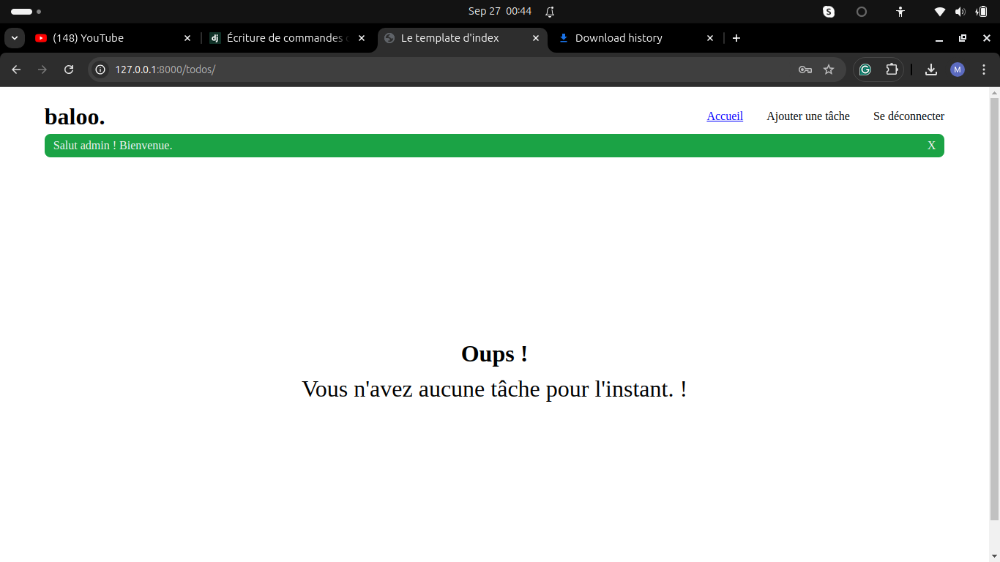

# baloo.

## Description
Cette application est une todo app(que j'ai personnellement nommé baloo.) construite avec Django. Elle inclut des fonctionnalités comme l'authentification, des sessions utilisateur, des messages flash dynamiques, du SASS pour le front-end et du JavaScript pour des interactions dynamiques.

## Fonctionnalités
- Authentification et création de compte
- Sessions utilisateur
- Messages flash dynamiques
- Création, modification et suppression de tâche
- Design responsive

## Technologies
- Django
- HTML
- SASS
- JavaScript
- SQLite3

## Captures d'écran 
### Page d'accueil


### Page de connexion


### Page de création de compte


### Page des tâches



### Page de modification d'une tâche


### Page de suppression d'une tâche 


## Installation
Pour cloner et exécuter cette application, suivez les étapes ci-dessous :

1. Clonez le dépôt :
    ```bash
    ** via https:
    git clone https://github.com/Dyma54/baloo_todo_app.git
    cd baloo_todo_app

    ** via ssh
    git clone git@github.com:Dyma54/baloo_todo_app.git
    cd baloo_todo_app
    ```

2. Créez et activez un environnement virtuel :
    ```bash
    python3 -m venv .env
    source .env/bin/activate  # Sur Windows, utilisez `.env\Scripts\activate`
    ```

3. Installez les dépendances :
    ```bash
    pip install -r requirements.txt
    ```

4. Appliquez les migrations de la base de données :
    ```bash
    python manage.py migrate
    ```

5. Lancez le serveur de développement :
    ```bash
    python manage.py runserver
    ```

6. Vous pouvez également initialiser le projet en tant qu'Admin avec la commande personnaliseé(Vous pourrez ainsi donc accéder au tableau d'administration de l'app. **_Attention: les données de la BD seront perdues. Il existera ensuite que l'admin dans la BD_**): 
```bash
   python manage.py login_as_admin
```

## Utilisation
1. Accédez à `http://127.0.0.1:8000` dans votre navigateur préféré.
2. Créez un compte ou connectez-vous pour commencer à gérer vos tâches.
3. Pour accéder à la page d'administration lorsque vous êtes admin: `http://127.0.0.1:8000/admin`
   **_(Email: admin@gmail.com | Mot de passe: admin@123)_**

## Contribution
Les contributions sont les bienvenues !

## Contact
KABORE Mady alias Dyma - [madykabore57@gmail.com]

Lien du projet : [https://github.com/Dyma54/baloo_todo_app]
